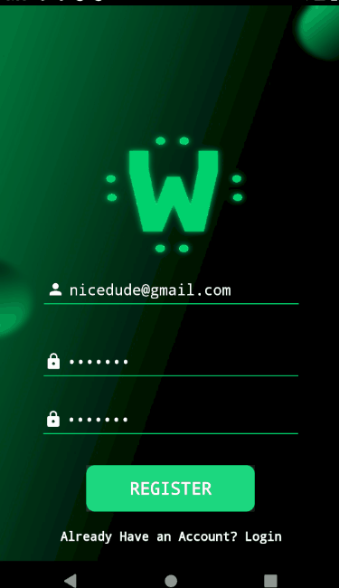
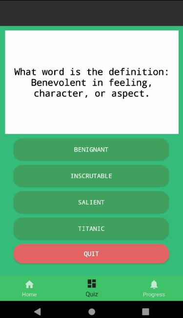
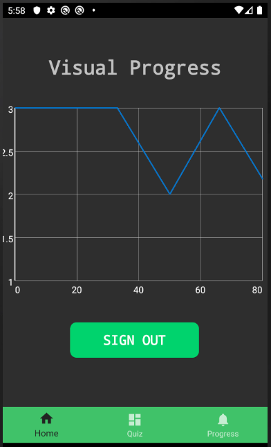

# Word-It: A simple SAT Quiz Application made to Increase Vocabulary

About
-------------
The Application is to help students wh oare having a hard time with teh vocab-in-context questions on the SAT.
The app helps create a way to interactively mesaure your progress over time and view them as a graphing chart.

Technologies Used
-------------

The technologies that I used were Firebase, GraphView, and JSON Parsing. I was able to store login information through authentication using Firebase. I used this and cahed information on the phone to be able to sign in with different accounts and have different data show up (ie: Graphs and Quizzes Completed). In order to visualize the progress, I used GraphView and was able to properly graph my points and display them to the user. After this, I implemented a sequential Typewriter script  to make the app seem smooth and professional. I parsed the JSON from my large data set and distributed them into their serialized classes. Finally, to have the quiz system flipper, I used a small animation library to help me implement it which is licensed under MIT. I implemented a custom quiz system which saved progress and tracked growth, which enables the user to improve themselves and to see all their best and worst scores on the graph.

What I Learned
-------------
What I learned through developing this app was to develop assets and learn how to do UI differently from the normal way. I created custom buttons and had designed my own graphics for the home page of the app from scratch! It was a truly great learning experience on building a real viable application. I do really hope that someone can learn from what I did. This also personally has helped me learn words for the SAT as well. It was a well rounded use of my time learning Android Development!

App In Action
-------------
### First is a demonstration of how to create an account:
</img>

### Now we can actually start quizzing ourselves
</img>

### After all that, we can check our progress
</img>

Licence
-------------
This code is licensed under the terms of the MIT License.
